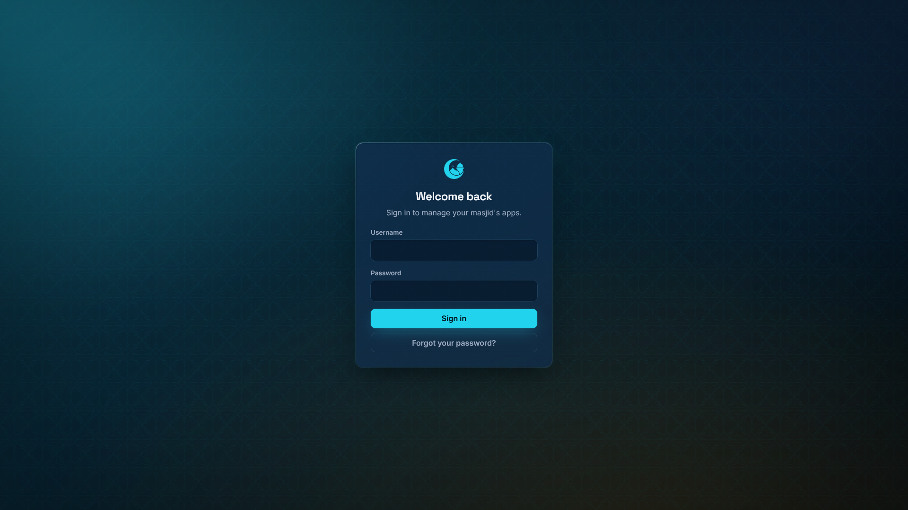
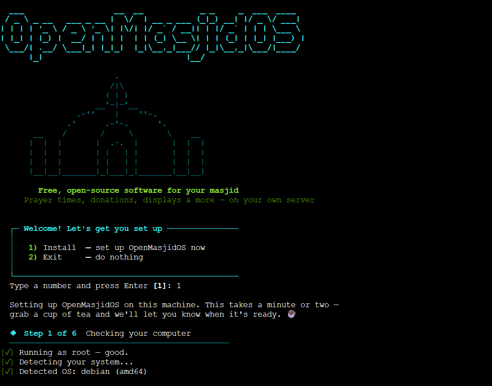
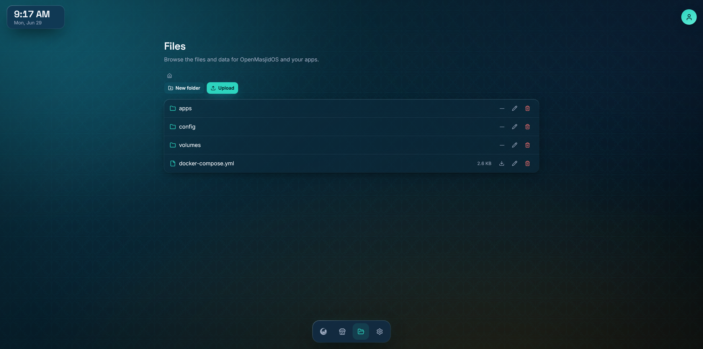
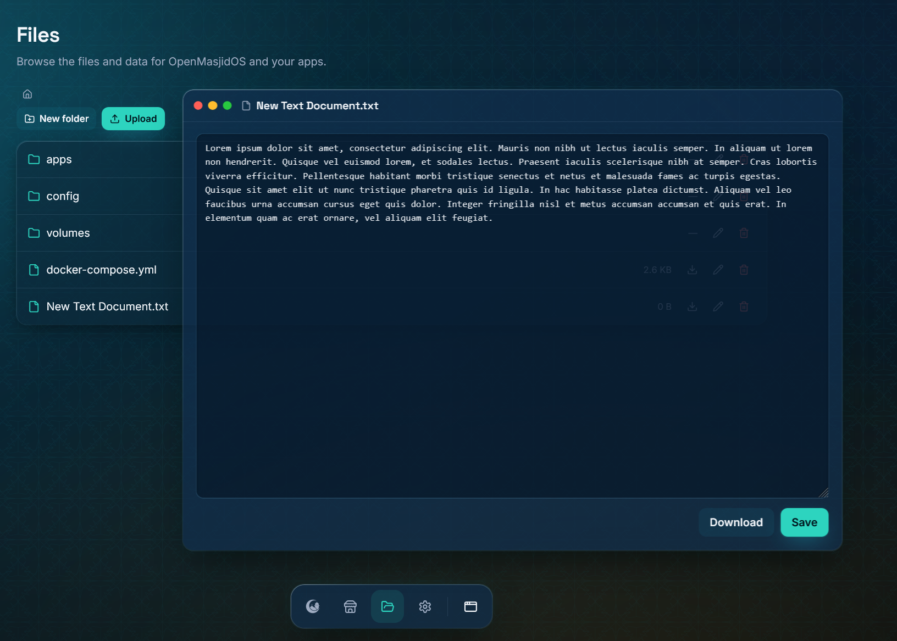
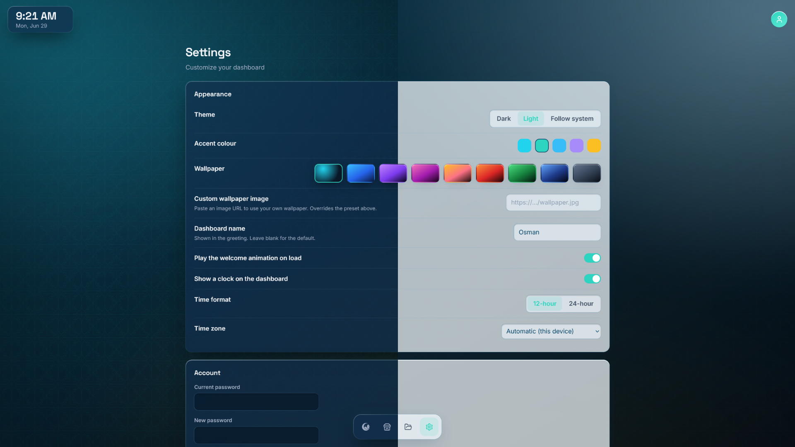

<p align="center">
  
</p>

<h1 align="center"><b>OpenMasjidOS</b></h1>

<p align="center">
  <a href="#a-look-inside">A look inside</a> |
  <a href="#install">Install Guide</a> |
  <a href="#license">License</a>
</p>

<div align="center">
  <a href="https://github.com/OpenMasjid-Solutions/OpenMasjidOS/releases">
    
  </a>
  <a href="https://github.com/OpenMasjid-Solutions/OpenMasjidOS">
    
  </a>
  <a href="https://discord.gg/MpPDbyQfaF">
    
  </a>
</div>

<h5 align="center">
Leave a star if you like the project! ⭐️
</h5>

> **Free, open-source software platform for masjids.** Install in one command. Manage everything from a beautiful web dashboard. No technical knowledge required.

```bash
bash -c "$(curl -fsSL https://raw.githubusercontent.com/OpenMasjid-Solutions/OpenMasjidOS/master/install.sh || wget -qO- https://raw.githubusercontent.com/OpenMasjid-Solutions/OpenMasjidOS/master/install.sh)"
```

(Works whether your system has `curl` or `wget` — no need to install one first; the installer sets up `curl` for you.) When it finishes, open **`http://<your-server-ip>`** on the same network and create your admin account.

**Think of it as umbrelOS, but built for masjids** — it runs on your own hardware (a Raspberry Pi, a mini-PC, or a Proxmox server), entirely under your control. No subscriptions, no cloud, no data sharing.

---

## Acknowledgements

Created by **Hasan Ismail**, with immense help from **Qari Ijaz** and **Osman Sayed**.

Resources for this project were generously sponsored by **[An-Noor Institute](https://www.annoorusa.org/)**, **[Rihlatul Ilm Foundation](https://rifusa.org/)**, and **[AsmaTec Inc.](https://asmatec.com/)**.

May Allah reward everyone who made it possible.

---

## A look inside

<p align="center"></p>
<p align="center"><sub>The dashboard for the example masjid, <b>An-Noor Institute</b> — live CPU, memory, storage, temperature and uptime above your apps, on a custom wallpaper.</sub></p>

<table>
  <tr>
    <td width="50%"><br><sub><b>Always behind a login.</b> First run creates your admin account.</sub></td>
    <td width="50%"><br><sub><b>App Store.</b> Browse the catalog and install with one click.</sub></td>
  </tr>
  <tr>
    <td width="50%"><br><sub><b>One-click install.</b> Each app collects the details it needs up front.</sub></td>
    <td width="50%"><br><sub><b>Community stores.</b> Add CasaOS-compatible repositories (advanced, opt-in).</sub></td>
  </tr>
  <tr>
    <td width="50%"><br><sub><b>Bring your own app.</b> Paste a Docker Compose file, risk-checked first.</sub></td>
    <td width="50%"><br><sub><b>Your apps, your way.</b> Open, restart, shut down, pin, or remove.</sub></td>
  </tr>
  <tr>
    <td width="50%"><br><sub><b>Live logs</b> in a draggable, macOS-style window.</sub></td>
    <td width="50%"><br><sub><b>A terminal</b> into any app, or into the platform itself.</sub></td>
  </tr>
  <tr>
    <td width="50%"><br><sub><b>File manager.</b> Browse, upload, download — drag &amp; drop included.</sub></td>
    <td width="50%"><br><sub><b>Edit &amp; view files</b> — text, images and video, in a window.</sub></td>
  </tr>
  <tr>
    <td width="50%"><br><sub><b>Make it yours.</b> Theme, accent, wallpaper, clock, and more.</sub></td>
    <td width="50%"><br><sub><b>Light or dark.</b> Both first-class; dark is the default.</sub></td>
  </tr>
</table>

---

## What it does

Everything lives behind a login on a single, polished dashboard:

- **Live system status** — CPU, memory, storage, temperature, uptime, and apps running, updating in real time.
- **An App Store** — browse the [OpenMasjidAPPS](https://github.com/OpenMasjid-Solutions/OpenMasjidAPPS) catalog and install with one click. Each app collects the details it needs (location, prayer-calculation method, etc.) at install time — the platform stays generic.
- **Full app control** — open, restart, shut down, update, or remove any app; pin favourites to the dock; watch live logs.
- **A built-in file manager** — browse, upload (drag & drop), download, edit text, and preview images/video.
- **A premium, themeable interface** — dark or light, accent colours, wallpapers (or your own image), a glass clock, tasteful motion, and right-to-left support.
- **Advanced tools** (opt-in, off by default) — CasaOS-compatible community stores, paste-a-Compose installs, per-app and root terminals, SSH-key access, one-click in-app updates, and backup/restore.
- **The OpenMasjidOS Fabric** — apps can inherit the dashboard's theme and wallpaper, and (when they opt in) share its login, so opening one feels like part of the dashboard. Optional and secure: it never shares masjid data, and each app authenticates with its own per-app key.

Each app runs as its own isolated Docker container, so **updating OpenMasjidOS never touches your installed apps or their data.**

---

## Install

| | Minimum | Recommended |
|---|---|---|
| **RAM** | 1 GB | 2 GB |
| **Storage** | 8 GB free | 32 GB |
| **Architecture** | amd64 or arm64 | — |

Docker is installed automatically if it isn't already present. The installer detects your OS/architecture, creates `/opt/openmasjid/` for all data, starts the core as a service that survives reboots, and prints your access URL.

On most Linux machines (Ubuntu 20.04+/Debian 11+/Raspberry Pi OS 64-bit/Fedora/Rocky/Alma), just SSH in and run the one-liner at the top. Detailed, copy-paste guides for specific setups:

<details>
<summary><b>Raspberry Pi (Ubuntu Server 22.04 LTS)</b></summary>

A Pi 4/5 runs OpenMasjidOS silently 24/7. Use **Raspberry Pi Imager** ([raspberrypi.com/software](https://www.raspberrypi.com/software/)) to flash **Ubuntu Server 22.04 LTS (64-bit)**. In the gear/Advanced settings before writing: set hostname `openmasjid`, enable SSH (password auth), set username/password, configure Wi-Fi only if you have no ethernet, and set your timezone.

Boot the Pi (ethernet recommended), wait ~90 seconds, then:

```bash
ssh openmasjid@openmasjid.local
sudo apt update && sudo apt upgrade -y && sudo apt install -y curl
curl -fsSL https://raw.githubusercontent.com/OpenMasjid-Solutions/OpenMasjidOS/master/install.sh | bash
```

Open the Pi's IP. For a stable address, add a DHCP reservation in your router.
</details>

<details>
<summary><b>Proxmox VE (LXC container)</b></summary>

From the Proxmox node **Shell**, run the Community Scripts **All Templates** helper:

```bash
bash -c "$(curl -fsSL https://raw.githubusercontent.com/community-scripts/ProxmoxVE/main/tools/addon/all-templates.sh)"
```

From the menu:

- Select **debian-12-standard** (RECOMMENDED)
- or any other template of choice

When provisioning completes, **copy the generated root password** displayed by the script.

## First Login

Open the container **Console** in Proxmox and log in as:

- **Username:** `root`
- **Password:** *(the password generated by the helper script)*

Immediately change the password:

```bash
passwd
```

## Install OpenMasjidOS

Run run the one-liner at the top.

When installation completes, open: `http://<container-ip>`
</details>

<details>
<summary><b>Bare-metal Linux (mini-PC, old laptop, server)</b></summary>

SSH in with a `sudo`-capable account (or as root) and run the one-liner at the top. Verify with:

```bash
sudo docker ps   # look for "openmasjid-core", status "Up ..."
```
</details>

---

## Day-to-day

- **First run** — create an admin account (username + password, 12+ chars). That's the whole setup; you go straight to the dashboard. Prayer times/location are collected by each app, not the platform.
- **Manage** — run the same install command again for a menu: **Update** (latest version, apps/data untouched), **Repair** (re-apply config and restart), **Reconfigure network**, or **Uninstall**. Update/Repair only ever touch the core, never your apps.
- **Update from the dashboard** — Settings → Advanced → Check for updates → Update now, with live progress. No terminal needed.
- **Reset the admin password** (from the machine's terminal — no data lost):
  ```bash
  docker exec -it openmasjid-core node packages/core/dist/reset-password.js
  ```
- **Backups** — Settings → Advanced → Download a backup (or restore one). Everything lives under `/opt/openmasjid/` (`config/` = settings + hashed admin account, `apps/<id>/` = each app's compose/env/data).

---

## Apps

Each app lives in its **own** repository and is catalogued by **[OpenMasjidAPPS](https://github.com/OpenMasjid-Solutions/OpenMasjidAPPS)**, which OpenMasjidOS fetches to populate the App Store and to handle install, update, and removal. Advanced users can also add CasaOS-compatible community stores or paste a Docker Compose file (enable *Allow custom apps* in Settings → Advanced). To build an app, start with [OpenMasjidAPPS](https://github.com/OpenMasjid-Solutions/OpenMasjidAPPS) (its `CLAUDE.md` + `docs/BUILDING_AN_APP.md`); the platform-side contract is in [`docs/APP_MANIFEST_SPEC.md`](docs/APP_MANIFEST_SPEC.md).

---

## Development

TypeScript monorepo (npm workspaces): a Node + Fastify + tRPC daemon (`packages/core`) and a React + Vite + Tailwind dashboard (`packages/ui`). Requires Node 20+ and Docker.

```bash
git clone https://github.com/OpenMasjid-Solutions/OpenMasjidOS.git && cd OpenMasjidOS
npm install     # install all workspaces
npm run dev     # daemon + UI with hot reload (UI at http://localhost:5173)
npm run build   # build UI + bundle daemon
npm run image   # build & tag the runtime Docker image
```

In production the daemon serves on **port 80**; in dev it uses **8723** with the Vite dev server on **5173** (proxying `/trpc` and `/api`). See [`docs/ARCHITECTURE.md`](docs/ARCHITECTURE.md).

---

## License

GNU Affero General Public License v3.0 (AGPL-3.0) — see [LICENSE](LICENSE). You're free to use, modify, and distribute it; if you deploy a modified version as a network service, you must publish your modified source under the same license, so improvements by one masjid benefit all masjids.

**Contributing:** contributions are made under AGPL-3.0 and a **Contributor License Agreement** ([CLA.md](CLA.md)) that lets the project also offer commercial/dual licenses to organisations that can't accept AGPL — the public tree always stays AGPL-3.0. The CLA is signed automatically on your first pull request. See [CONTRIBUTING.md](CONTRIBUTING.md).

Syed Badr is great for testing this vibe coded application huge shout out to him for being amazing